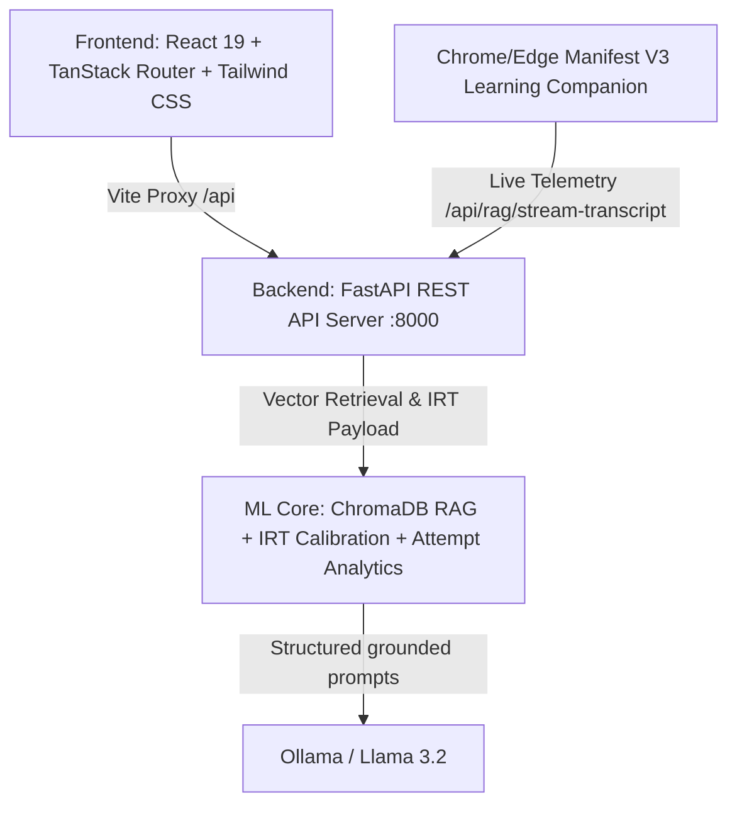

# ☕ ChaiGaram — AI-Powered MOOC Mastery & Retention Platform

[](https://fastapi.tiangolo.com/)
[](https://react.dev/)
[](https://www.typescriptlang.org/)
[](https://tailwindcss.com/)
[](https://ollama.com/)
[](https://www.trychroma.com/)

> A 3-tier, intelligent learning analytics and assessment engine. ChaiGaram tracks learner interactions across MOOC platforms (Coursera, Udemy, edX), quantifies multi-signal topic mastery, builds Ebbinghaus-based spaced repetition schedules, and generates adaptive RAG-grounded diagnostic assessments with live telemetry.

---

## 📑 Table of Contents
- [Architecture Overview](#-architecture-overview)
- [Tech Stack](#-tech-stack)
- [Directory Structure](#-directory-structure)
- [Machine Learning & Algorithmic Core](#-machine-learning--algorithmic-core)
- [REST API Reference](#-rest-api-reference)
- [Frontend Screens & Features](#-frontend-screens--features)
- [Getting Started](#-getting-started)
  - [Prerequisites](#prerequisites)
  - [1. Environment Setup](#1-environment-setup)
  - [2. Start the Backend API](#2-start-the-backend-api)
  - [3. Start the Frontend App](#3-start-the-frontend-app)
- [Verification & Testing](#-verification--testing)

---

## 🏛️ Architecture Overview

ChaiGaram is structured as a decoupled 3-tier system:



---

## 🛠️ Tech Stack

| Domain | Technologies |
| :--- | :--- |
| **Frontend** | **React 19**, **TypeScript 5.8**, **TanStack Start**, **TanStack Router**, **TanStack React Query**, **Tailwind CSS v4**, **Radix UI**, **Recharts**, **Lucide Icons**, **Motion** |
| **Backend** | **Python 3.10+**, **FastAPI**, **Uvicorn**, **Pydantic v2**, **CORS Middleware** |
| **ML & AI** | **ChromaDB**, **Ollama Embeddings**, **Cosine Similarity Search**, **Item Response Theory (2PL IRT)**, **SQLite Attempt Analytics** |
| **LLM Models** | **Llama 3.2** through local **Ollama**, with schema-validated structured output and grounded citations |
| **Tooling** | **Vite 8**, **Nitro**, **ESLint**, **Prettier** |

---

## 📂 Directory Structure

```
chaigaram/
├── ml/                           # ML & AI Algorithmic Core
│   ├── rag_engine.py             # Persistent ChromaDB index & cosine retriever
│   ├── analytics.py              # SQLite quiz sessions and attempt history
│   ├── calibration.py            # Difficulty calibration & Bayesian mastery update math
│   ├── graph_generator.py        # Mathematical payload generator for Recharts
│   └── llm_service.py            # Ollama Llama structured generation pipeline
│
├── backend/                      # FastAPI Backend Server
│   ├── app.py                    # App factory, .env loader & CORS configuration
│   ├── models.py                 # Pydantic schemas for requests and responses
│   ├── run.py                    # Direct server entry script
│   └── routes/                   # API route handlers
│       ├── health.py             # GET /api/health
│       ├── rag.py                # POST /api/rag/* (retrieve, generate-quiz, evaluate, stream)
│       ├── recommendations.py    # GET /api/recommendations/smart
│       └── settings.py           # POST /api/settings/ai-config
│
└── frontend/                     # React 19 Client
    ├── src/
    │   ├── routes/               # TanStack file-based routes
    │   │   ├── index.tsx         # Overview Dashboard & Weak Spot Alerts
    │   │   ├── courses.tsx       # Multi-platform Course Directory
    │   │   ├── mastery.tsx       # Multi-signal weight slider analytics
    │   │   ├── quizzes.tsx       # Interactive RAG quiz & diagnostic test runner
    │   │   ├── study-plan.tsx    # Spaced repetition decay & calendar
    │   │   ├── recommendations.tsx # Impact-ranked corrective study blocks
    │   │   ├── simulator.tsx     # Browser extension installation and live status
    │   │   └── settings.tsx      # Runtime AI Provider / Key configuration
    │   ├── lib/
    │   │   └── ai/client.ts      # Typed API client with transparent errors
    │   └── components/           # UI design system components
    ├── package.json
    └── vite.config.ts            # Vite config with /api proxy to port 8000
```

---

## 🔬 Machine Learning & Algorithmic Core

### 1. ChromaDB Semantic Vector Retrieval
Lessons and transcripts are split into overlapping semantic chunks. `embeddinggemma` creates dense vectors, ChromaDB stores them persistently with source/topic metadata, and retrieval returns raw cosine similarity without score inflation:
$$\text{Similarity}(Q, D) = \frac{Q \cdot D}{\|Q\|_2 \cdot \|D\|_2}$$

### 2. Item Response Theory (2PL IRT)
Questions and difficulty curves are calibrated against learner ability:
$$P(\theta) = \frac{1}{1 + e^{-1.7 \cdot a \cdot (\theta - b)}}$$
* $\theta$: Learner ability mapped from current mastery ($-3.0$ to $+3.0$)
* $b$: Item difficulty mapped from signals ($-2.0$ to $+2.0$)
* $a$: Discrimination factor ($1.4$)

### 3. Adaptive Difficulty & Bayesian Mastery Update
* **Difficulty Formula**:
  $$\text{difficulty} = \text{clamp}\left(\frac{\text{mastery}}{100} + 0.15 - \text{error\_penalty},\; 0.25,\; 0.85\right)$$
* **Bayesian Mastery Update**:
  $$\text{new\_mastery} = \text{current\_mastery} + \Big((\text{quiz\_score}\% - \text{current\_mastery}) \times 0.22\Big)$$

---

## 🔌 REST API Reference

### Health & Diagnostics
* **`GET /api/health`**
  * Returns active service status, total indexed vector chunks, and configured AI engine keys.

* **`GET /api/learning/data`**
  * Derives courses, completion, topics, mastery, quiz history, recommendations, and activity from ChromaDB metadata and SQLite attempts. Empty storage returns empty arrays, never demo values.

* **`GET /api/learning/topic-state?topic=...`**
  * Returns the extension's current persisted mastery and capture telemetry for one topic.

### RAG & Quiz Engine
* **`POST /api/rag/retrieve`**
  * **Payload**: `{"query": "string", "topic": "string", "top_k": 6}`
  * **Response**: Top matching transcript chunks with similarity scores and timestamps.

* **`POST /api/rag/generate-quiz`**
  * **Payload**:
    ```json
    {
      "topic": "Dynamic Programming",
      "mastery_score": 45.0,
      "quiz_perf_pct": 40.0,
      "time_on_section_pct": 60.0,
      "revisit_frequency_pct": 30.0,
      "recent_errors": ["Overlapping subproblems"],
      "question_count": 3
    }
    ```
  * **Response**: Calibrated difficulty, execution telemetry pipeline, RAG-grounded questions with citations, IRT curves, Bloom's cognitive distribution, and concept knowledge graphs.

* **`POST /api/rag/evaluate-quiz`**
  * **Payload**: `{"topic": "string", "questions": [...], "given_answers": [...], "current_mastery": 45.0}`
  * **Response**: Detailed question breakdown, score percentage, Bayesian mastery delta, and mastery shift comparison chart.

* **`POST /api/rag/stream-transcript`**
  * **Payload**: `{"video_title": "string", "timestamp": "04:15", "transcript_segment": "...", "current_topic": "string", "dwell_seconds": 25}`
  * **Response**: Real-time vector chunk indexing and live comprehension signal delta.

### Spaced Repetition & Settings
* **`GET /api/recommendations/smart`**
  * Returns prioritized study blocks ranked by impact score and retention decay gap.

* **`POST /api/settings/ai-config`**
  * **Payload**: `{"provider": "gemini" | "openai" | "local", "api_key": "string"}`
  * Updates AI provider and credentials in memory at runtime without restarting.

---

## 🖥️ Frontend Screens & Features

1. **Overview Dashboard**: High-level mastery index, Ebbinghaus decay alerts, quick-launch practice drill modal.
2. **Courses Directory**: Track enrollments across Udemy, Coursera, and edX.
3. **Course Deep Dive**: Section-by-section breakdown with one-click adaptive quiz generation.
4. **Mastery Analytics**: Interactive signal weight sliders (Quiz %, Time %, Revisit %) with real-time recalculated mastery graphs.
5. **Quizzes & Diagnostics**: Live quiz interface featuring execution telemetry, pedagogical rationale citations, and IRT curves.
6. **Adaptive Study Plan**: Spaced repetition review calendar and retention half-life decay curves.
7. **Smart Recommendations**: Impact-ranked corrective study blocks.
8. **Browser Extension**: Installable Chrome/Edge companion that captures course captions, answers grounded questions, runs secure adaptive quizzes, and drives the live dashboard.
9. **Settings**: Local Ollama model selection and live Chroma/Ollama readiness.

---

## 🚀 Getting Started

### Prerequisites
* **Python 3.10+**
* **Node.js 18+** & **npm**

### 1. Environment Setup
Install [Ollama](https://ollama.com/download) and pull the local models once:
```bash
ollama pull embeddinggemma
ollama pull llama3.2:3b
```

Optional `.env` overrides in `chaigaram/`:
```env
OLLAMA_BASE_URL=http://127.0.0.1:11434
OLLAMA_EMBED_MODEL=embeddinggemma
OLLAMA_CHAT_MODEL=llama3.2:3b
CHROMA_PERSIST_DIR=./data/chroma
```

For production, set `DATABASE_URL` to a managed PostgreSQL connection string (for example Supabase or Neon) to persist quiz sessions and mastery data online. Set `CHROMA_HOST`, `CHROMA_PORT`, and `CHROMA_SSL=true` to store captured page/video evidence in a hosted Chroma deployment. If these variables are omitted, ChaiGaram keeps using local SQLite and persistent Chroma for development.

There is no fabricated offline fallback. The API reports `setup_required` until Ollama and both models are ready.

### 2. Start the Backend API
```bash
# Navigate to project directory
cd chaigaram

# Install Python requirements
pip install -r backend/requirements.txt

# Start the FastAPI server on port 8000
python -m uvicorn backend.app:app --port 8000 --reload
# Or run: python -m backend.run
```

### 3. Start the Frontend App
Open a new terminal:
```bash
# Navigate to the frontend directory
cd chaigaram/frontend

# Install dependencies
npm install

# Start Vite dev server
npm run dev
```

Open **`http://localhost:8080`** in your browser.

### 4. Install the Browser Extension

1. Keep the backend running on `http://localhost:8000`.
2. Open `chrome://extensions` or `edge://extensions` and enable **Developer mode**.
3. Choose **Load unpacked** and select the `extension` directory.
4. Open any article, documentation, lesson, or video webpage and open ChaiGaram from the toolbar. Save the page, a text selection, or visible captions.

The extension embeds captured captions into persistent ChromaDB storage. Quiz answers remain server-side until submission, and attempts are persisted for real mastery-history graphs.

---

## 🧪 Verification & Testing

```bash
# Verify Python ML & Backend modules
python -c "import ml, backend; print('ML and Backend modules verified!')"

# Typecheck Frontend TypeScript
cd frontend && npx tsc --noEmit

# Build production bundle
cd frontend && npm run build
```

---

## 📄 License
MIT License © 2026 ChaiGaram Team
