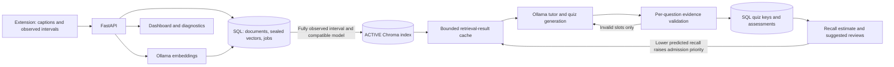
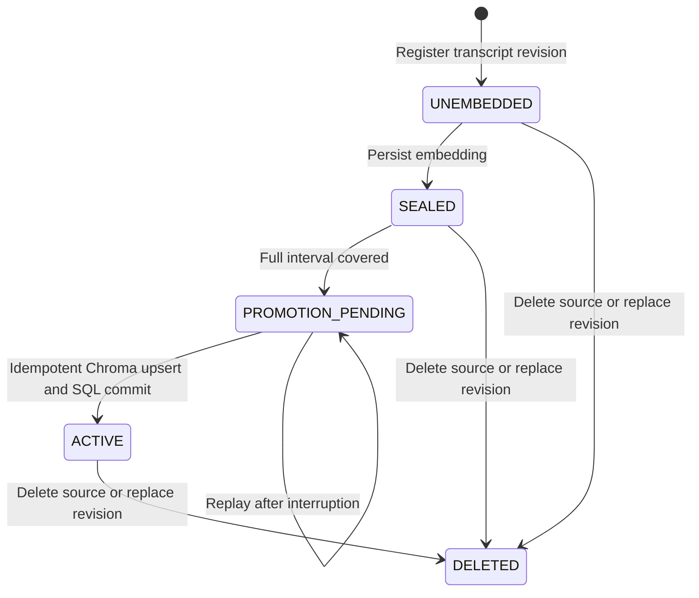

# Observation-gated learning system

## Data flow

Full caption tracks, including future content, can be stored and embedded in SQL.
Only chunks fully covered by observed intervals enter the searchable index.
Ordinary documents are immediately searchable. The gate limits retrieval scope;
it cannot prevent model prior knowledge or fabricated client observation claims.

## States, jobs, and recovery

Promotion reuses a persisted embedding. It writes a durable intent, performs an
idempotent Chroma upsert, and commits ACTIVE in SQL. This is recoverable work
across two stores, not an atomic distributed transaction. Startup replays pending
promotion and deletion. Mutation invalidates cached retrieval results.

Jobs persist input, operation, status, stage, checkpoints, attempts, and results.
A request ID is reusable only with the same operation and normalized payload.
Atomic claiming prevents two local workers executing the same queued job. Startup
requeues interrupted jobs. Saved validated output survives interruption before
the terminal status write. Already-persisted embeddings are reused on restart.
Deletion clears attached job payloads/checkpoints/results; late completion cannot
publish a cancelled result.

A dedicated speculation worker yields between chunks during interactive work.
Admission uses idle state, queue depth, measured chunk cost, a five-minute future
horizon, and an estimated memory allowance. Periodic single-chunk probes prevent
a slow cold-model load from permanently starving work. In-flight embedding calls
cannot be preempted, so the time budget is a target rather than a hard deadline.

Run one backend process. Cross-process worker leases are not implemented. A model
call interrupted before its output checkpoint may repeat. Quiz creation and job
completion are not one transaction. Deletion cannot undo a model call or every
side effect of a handler already executing.

## Cache and legacy migration

Retrieval-result cache keys include model version, query, topic, document ID,
result count, and topic-scope policy. Query embeddings have a separate byte-bounded
cache keyed by model version and normalized query text; they can be reused across
different ACTIVE search scopes. Only ACTIVE retrieval results are cached, with
defensive copies on read. Entries expire after five minutes. Admission and eviction use
the latest assessed topic recall: lower predicted recall has higher priority,
with LRU breaking equal-priority ties. Unassessed or mixed-topic results use a
neutral priority. Assessment or vector mutations invalidate the cache, and the
recall model is rebuilt on the next scoped retrieval.
`RAG_CACHE_BYTES` and `RAG_QUERY_VECTOR_CACHE_BYTES` bound serialized keys and
payloads of their respective caches, not total process RSS.

`POST /api/vectors/migrate` previews migration by default. Only records explicitly
marked `source_type=document` with an exact compatible `model_version` can be
copied. Unknown provenance and all legacy videos are skipped. Existing ACTIVE
IDs are preserved, source collections remain untouched, and no embedding calls
are made. Re-ingest sources whose original model cannot be verified.

## Assessments and recall

Selective repair preserves accepted slots and requests only replacements. The
quiz prompt offers source-derived, verbatim quote choices to the local model;
validation still requires a quote inside its cited ACTIVE chunk. Each
accepted question passes schema, four-choice, answer-match, language, citation,
exact-quote, evidence-overlap, and duplicate checks. Quotes must occur inside one
cited chunk. A quiz fails closed after three attempts. Answers remain server-side
until evaluation.

Difficulty is a mastery/error heuristic. The illustrative IRT curve has fixed,
unestimated parameters. Assessment mastery uses a fixed 0.22 update rate;
dashboard mastery is a weighted signal score. These are separate measures.

Recall uses the previous assessment score and elapsed days to predict the next
assessment score. Fewer than 20 usable outcome pairs, or no variation in outcomes,
produces a clearly labelled cold-start heuristic. Otherwise a regularized,
constrained logistic model is fitted to the available history. Training respects
chronology and elapsed time cannot increase recall. Diagnostics show in-sample
error only; predictive accuracy is not established. Unassessed topics show no
probability. Suggested reviews do not count as completed work or improve forecasts.

## Security and privacy boundaries

- Backend endpoints have no authentication or per-user learning-data isolation.
  Use loopback for local operation. Firebase protects profile documents only.
- CORS defaults to local dashboard URLs and extension origins. It is not
  authentication; configure `CORS_ORIGINS` for a different dashboard address.
- Rendered/decoded-frame callbacks and visibility checks support observation
  intervals in the shipped extension. The server does not attest these claims.
- Source content is untrusted data. Prompt constraints and mechanical validation
  do not prove every generated statement is semantically correct.
- Connection URLs require HTTP/HTTPS without credentials, queries, or fragments.
  Remote configurations send captured data to those remote services.
- Caption tracks, sealed vectors, quiz keys, and job inputs persist on the backend.
  Pending retry signatures remain in extension local storage until a terminal
  result. Diagnostics omit sealed text, job inputs, and answer keys.
- Metrics/cache counters are process-local. The bounded cache does not bound all
  backend memory, SQL storage, or model-server memory.

## Reproduce the checks

1. `python -m unittest discover -s tests -v`
2. `node --test tests/observation.test.cjs tests/extension_jobs.test.cjs tests/connection.test.cjs`
3. In `frontend`: `npx.cmd tsc --noEmit`, `npm.cmd run lint`, `npm.cmd run build`.
4. `python scripts/benchmark_features.py`: writes raw trials, summary JSON, and
   a chart under `patent/results`. Synthetic embeddings isolate pipeline overhead;
   these numbers are not production-model speedup evidence.
5. With Ollama running: `python scripts/check_live_models.py` runs real embedding,
   retrieval, answering, summarization, and quiz generation on disposable data.
6. `python scripts/check_browser.py` uses a fresh Chrome profile, real MV3 loading,
   temporary databases, and ports 8001/8081/8091. It stops its own processes and
   writes a report and screenshot under `patent/results`. Install its optional
   harness dependencies with `python -m pip install websocket-client imageio-ffmpeg`.
   Set `BROWSER_SKIP_LIVE_QUIZ=1` to run the extension checks without waiting for
   a stochastic local model to generate the dashboard's three-question quiz.

For a manual gate demonstration, watch an opening video segment, skip an interval,
and pause. Diagnostics show the skipped chunk SEALED; retrieval must exclude it.
Rewind and watch it to permit promotion without another embedding call.

Google sign-in, remote databases, and each third-party caption integration require
environment-specific checks. Continuously changing live-caption snapshots may
invalidate previous revisions and cause repeated embedding work.
